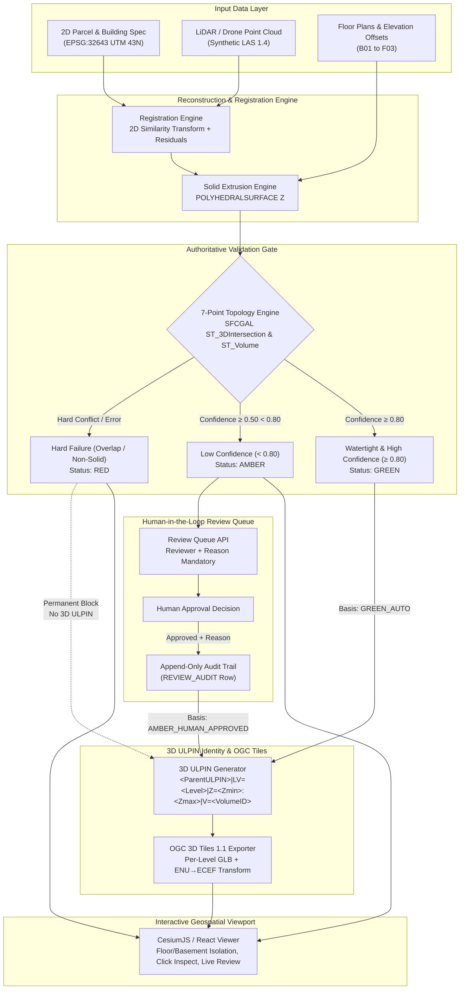

# BHU-VISTA 3D (Aayam — आयाम)
**Evidence-Backed 3D Cadastral Property Identity System**
*Smart India Hackathon 2026* | **Problem Statement:** SIH26011 | **Team:** Syndicate (ID: 127351)

---

## 1. What It Is

**BHU-VISTA 3D (Aayam)** extends India's 14-digit 2D Bhu-Aadhaar (ULPIN) into an authoritative, topologically validated, multi-story 3D cadastral registry. It extrudes floor plans, registers LiDAR/drone point clouds, runs a strict 7-point 3D spatial topology validation gate, manages human-in-the-loop reviews for ambiguous geometry, and issues structured 3D ULPIN identifiers streamed into CesiumJS via OGC 3D Tiles 1.1.

---

## 2. System Architecture



---

## 3. How to Run

### Local Execution on Windows
1. **Backend Service (FastAPI):**
   ```powershell
   # Run from project root:
   pip install -r requirements.txt
   uvicorn api.main:app --host 0.0.0.0 --port 8000
   ```
   - API Swagger Documentation: `http://localhost:8000/docs`
   - Provenance Root: `http://localhost:8000/`

2. **Frontend Viewer (CesiumJS + React + Vite):**
   ```powershell
   # Run from viewer directory:
   cd viewer
   npm.cmd install
   npm.cmd run dev
   ```
   - Access viewer at: `http://localhost:5173`

3. **Containerized Execution (if Docker is installed):**
   ```bash
   # Stop local uvicorn and Vite servers first to free ports 8000 & 5173
   docker compose up --build
   ```

4. **Automated Test Suite (92 Tests):**
   ```powershell
   python -m pytest tests/ -v --tb=short
   ```


---

## 4. Authoritative Validation Gate & Status Rules

Every 3D volume undergoes a non-negotiable 7-stage topology audit:
1. **Closed Watertight Solid:** ST_IsClosed / 2-manifold verification.
2. **Self-Intersection:** ST_IsSimple / ST_IsValid check.
3. **Z-Range:** Zmin < Zmax with matching level code vertical bounds.
4. **Parcel Containment:** Horizontal footprint strictly inside parent parcel boundaries.
5. **Floating Volume:** No unsupported overhangs; footprint supported by slab below or ground.
6. **Exclusive Volumetric Overlap:** Authority is 3D intersection volume (`ST_3DIntersection` + `ST_Volume`). Shared touching faces (`volume = 0.000 m³`) are allowed; overlap > 0.001 m³ is an immediate hard failure.
7. **Neighbour Consistency:** Same-floor units partition without internal volumetric overlap.

### Verdict Resolution Formula
$$\text{Status} = \begin{cases} \mathbf{RED} & \text{if any hard failure (overlap, non-solid, SFCGAL error)} \\ \mathbf{GREEN} & \text{if confidence} \ge 0.80 \\ \mathbf{AMBER} & \text{if } 0.50 \le \text{confidence} < 0.80 \\ \mathbf{RED} & \text{if confidence} < 0.50 \end{cases}$$

- **SFCGAL Failure Rule:** Any geometry error or NULL return from SFCGAL registers check `ERROR`, code `SFCGAL_FAILURE`, and sets status to **RED**. It never crashes and never passes.

---

## 5. Human Review Workflow & Audit Trail

| Status | 3D ULPIN Issuance | Review Action Allowed | Behavior |
| :--- | :--- | :--- | :--- |
| **GREEN** | ✅ Auto-Issued (`GREEN_AUTO`) | None needed | Authoritative 3D ULPIN immediately valid. |
| **AMBER** | ⏳ Blocked while `PENDING` | `APPROVE` or `REJECT` | Requires official reviewer identity + mandatory non-empty justification. If approved: review_status = `APPROVED`, topology_status stays `AMBER` (provenance preserved), basis = `AMBER_HUMAN_APPROVED`. |
| **RED** | ⛔ Never Issued | None (Strictly Blocked) | `POST /api/v1/validation/approve` returns HTTP 400 (`PermissionError`). Enforced in code and database trigger. |

---

## 6. Provenance & Versioning (Principle 7)

Re-running the reconstruction pipeline (`POST /api/v1/pipeline/rerun`):
1. Increments `version = version + 1`.
2. Marks all prior volume records `superseded = true`.
3. Preserves stable 3-digit volume IDs (`001` through `009`) ordered by Zmin and unit label.
4. Does **not** carry over previous human review approvals; requires fresh human inspection for AMBER units.

---

## 7. Real vs. Simulated Components

Per SIH Principle 12 (Honest Labelling), every component clearly declares its real vs. simulated boundary:

| Component | Status | Implementation Details |
| :--- | :---: | :--- |
| **3D Topology Engine** | **REAL** | Shapely / PostGIS SFCGAL 7-point volumetric checks, ST_3DIntersection overlap authority. |
| **3D ULPIN Identity Gate** | **REAL** | Authoritative generator, strict basis tagging (`GREEN_AUTO`, `AMBER_HUMAN_APPROVED`), hard RED blockage. |
| **OGC 3D Tiles 1.1 Exporter** | **REAL** | Python trimesh to binary GLB, ENU-to-ECEF pyproj transform, validated via official `npx 3d-tiles-validator` (0 errors). |
| **CesiumJS Interactive Viewer** | **REAL** | Real-time viewport, floor/basement isolation, camera positioning, click-picking live API integration. |
| **OpenDroneMap (ODM)** | **SIMULATED** | Adapter architecture implemented; pipeline returns simulated photogrammetric point cloud with authentic metadata. |
| **LiDAR Point Cloud** | **SYNTHETIC** | Synthetically generated LAS 1.4 dataset (ground points + roof/slab points + noise) with authentic LAS headers. |
| **Floor Plans & Parcel** | **SYNTHETIC** | Synthetic GeoJSON specifications modeled after Kurla, Mumbai Suburban survey parcel 142/3. |
| **Ownership Registry** | **MOCK** | Demo ownership table linking unit codes to mock citizen names and registry deed numbers. |

---

## 8. Known Limitations
1. **Local SFCGAL Backend:** Production deployments utilize PostgreSQL 16 + PostGIS 3.5 with CG_SFCGAL; lightweight testing environments use pure Python/Shapely 3D fallback approximations.
2. **Point Cloud 3D Tiles Streaming:** Point cloud is stored as raw LAS 1.4 in EPSG:32643. Real-time point-cloud viewing in Cesium requires pre-tiling to 3D Tiles `.pnts`, currently flagged as "Point Cloud (Not available)" in the UI.
3. **Single Building Demonstration:** The MVP is benchmarked against `BLD-MUM-001` (Syndicate Heights, 5 levels, 9 units). Multi-building batch processing is managed through Celery task workers.
